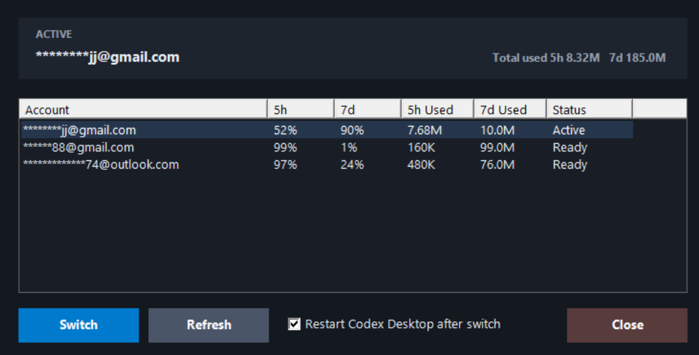

# codex-switch

**You Only Oauth Once**

中文 | [English](#english)

Windows 上的 OpenAI Codex Desktop 账号切换工具。每个 ChatGPT / OpenAI 账号只需要通过官方 `codex login` 登录并导入一次，之后就可以在一个小面板里快速切换账号，同时保留同一套 Codex 历史记录。



> 非官方社区工具，与 OpenAI 官方无关。

## 功能

- Windows 上一键切换 Codex 账号
- 使用官方 `codex login` 产生的 OAuth token
- 多账号共享 `%USERPROFILE%\.codex\sessions` 历史记录
- 切换后可自动重启 Codex Desktop，让新账号立即生效
- 显示每个账号的 5 小时 / 7 天剩余额度
- 根据额度百分比估算已使用 token
- 默认隐藏邮箱前半部分，方便截图演示
- 支持 OpenAI-compatible API key 服务商
- 内置实验性的本地 aggregate gateway

## 环境要求

- Windows
- Node.js 18+
- 已安装 OpenAI Codex CLI / Desktop，并且命令行中可以使用 `codex`

## 安装

```powershell
npm install
node .\codex-switch.js init
```

可选：创建桌面快捷方式。

```powershell
npm run shortcut
```

也可以直接双击：

```text
Codex Switch.cmd
```

## 添加账号

先使用官方 Codex OAuth 登录，再把 token 导入到 codex-switch：

```powershell
codex login
npm run import:codex-auth -- "account label"
```

每个账号重复一次。

查看账号列表：

```powershell
node .\codex-switch.js list
```

## 启动面板

```powershell
npm run panel
```

选择账号后点击 `Switch`。Codex Desktop 会在内存里缓存登录状态，所以面板支持切换后自动重启 Codex Desktop。

## 额度和 Token 估算

面板显示的是剩余额度：

- `5h`：5 小时滚动窗口剩余额度
- `7d`：7 天滚动窗口剩余额度

已使用 token 是本地估算值：

```text
5h Used = 16M * (100 - 5h remaining %) / 100
7d Used = 100M * (100 - 7d remaining %) / 100
```

这些不是官方账单 token。Codex 当前暴露的是 rate-limit 百分比，不是精确的账号计费明细。

## 手动切换

```powershell
node .\codex-switch.js use --provider openai-oauth --account openai-xxxxxxxx
```

切换时会写入：

- `%USERPROFILE%\.codex\auth.json`
- `%USERPROFILE%\.codex\config.toml`

不会移动：

- `%USERPROFILE%\.codex\sessions`
- `%USERPROFILE%\.codex\archived_sessions`

## OpenAI-Compatible Provider

```powershell
node .\codex-switch.js add-provider --id openrouter --label "OpenRouter" --kind openai-compatible --base-url "https://openrouter.ai/api/v1"
node .\codex-switch.js add-account --provider openrouter --label "OpenRouter Main" --api-key "sk-or-..."
node .\codex-switch.js use --provider openrouter --account acct-xxxxxxxx
```

## 实验性 Aggregate Gateway

```powershell
node .\codex-switch.js aggregate-on
node .\codex-switch.js gateway-start
```

这会把 Codex 指向：

```text
http://127.0.0.1:1456/v1
```

Gateway 仍是实验功能。

## 配置位置

codex-switch 的配置文件在：

```text
%USERPROFILE%\.codex-switch\config.json
```

如果检测到旧版 `%USERPROFILE%\.codexbar-win\config.json`，会自动复制迁移。

## 开发检查

```powershell
npm run test:gateway
npm run smoke
npm run usage -- --json
node --check .\codex-switch.js
node --check .\usage.js
powershell -NoProfile -ExecutionPolicy Bypass -File .\codex-switch-panel.ps1 -NoLaunch
```

## 安全说明

OAuth token 只保存在本机。详见 [SECURITY.md](SECURITY.md)。

---

## English

**codex-switch** is a Windows account switcher for OpenAI Codex Desktop. Import each ChatGPT / OpenAI account once with the official `codex login` flow, then switch accounts from a small native panel while keeping one shared Codex history.

> Unofficial community tool. Not affiliated with OpenAI.

## Features

- One-click Codex account switching on Windows
- Uses official Codex OAuth tokens imported from `codex login`
- Keeps `%USERPROFILE%\.codex\sessions` shared across accounts
- Optionally restarts Codex Desktop after switching so the new auth takes effect
- Shows 5-hour / 7-day remaining quota per account
- Estimates used tokens from quota percentages
- Masks email names by default for screenshots and demos
- Supports OpenAI-compatible API key providers
- Includes an experimental local aggregate gateway

## Requirements

- Windows
- Node.js 18+
- OpenAI Codex CLI / Desktop installed and available as `codex`

## Install

```powershell
npm install
node .\codex-switch.js init
```

Optional desktop shortcut:

```powershell
npm run shortcut
```

You can also double-click:

```text
Codex Switch.cmd
```

## Add Accounts

Use official Codex OAuth login, then import the token into codex-switch:

```powershell
codex login
npm run import:codex-auth -- "account label"
```

Repeat once per account.

List accounts:

```powershell
node .\codex-switch.js list
```

## Start The Panel

```powershell
npm run panel
```

Select an account and click `Switch`. Codex Desktop caches auth in memory, so the panel can restart Codex Desktop after switching.

## Quota And Token Estimates

The panel shows remaining quota:

- `5h`: remaining 5-hour rolling quota
- `7d`: remaining weekly rolling quota

Used-token estimates are local approximations:

```text
5h Used = 16M * (100 - 5h remaining %) / 100
7d Used = 100M * (100 - 7d remaining %) / 100
```

These are not official billable token counts. Codex exposes rate-limit percentages, not exact per-account billing totals.

## Manual Switching

```powershell
node .\codex-switch.js use --provider openai-oauth --account openai-xxxxxxxx
```

Switching writes:

- `%USERPROFILE%\.codex\auth.json`
- `%USERPROFILE%\.codex\config.toml`

It does not move:

- `%USERPROFILE%\.codex\sessions`
- `%USERPROFILE%\.codex\archived_sessions`

## OpenAI-Compatible Providers

```powershell
node .\codex-switch.js add-provider --id openrouter --label "OpenRouter" --kind openai-compatible --base-url "https://openrouter.ai/api/v1"
node .\codex-switch.js add-account --provider openrouter --label "OpenRouter Main" --api-key "sk-or-..."
node .\codex-switch.js use --provider openrouter --account acct-xxxxxxxx
```

## Experimental Aggregate Gateway

```powershell
node .\codex-switch.js aggregate-on
node .\codex-switch.js gateway-start
```

This points Codex at:

```text
http://127.0.0.1:1456/v1
```

Gateway support is experimental.

## Config

codex-switch stores its own config in:

```text
%USERPROFILE%\.codex-switch\config.json
```

If an older `%USERPROFILE%\.codexbar-win\config.json` exists, it is copied forward automatically.

## Development

```powershell
npm run test:gateway
npm run smoke
npm run usage -- --json
node --check .\codex-switch.js
node --check .\usage.js
powershell -NoProfile -ExecutionPolicy Bypass -File .\codex-switch-panel.ps1 -NoLaunch
```

## Security

OAuth tokens stay local. See [SECURITY.md](SECURITY.md).
